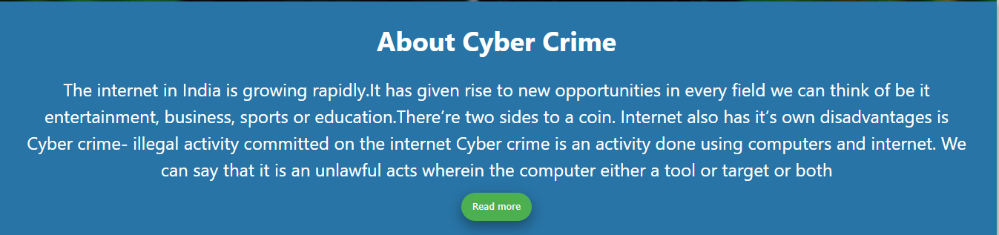
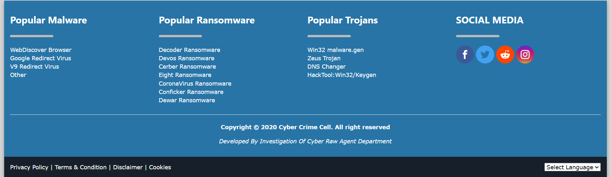

#E34F26
<!-- PROJECT LOGO -->
 

  

  <h1 align="center">Cyber Crime Cell</h1>
  
[ INVESTIGATION OF CYBER RAW AGENT- ICRA ]

   Diploma Final Year Project Report - 2020
     
    <a href="#"><strong>Explore the docs »</strong></a>
     
     
    <a href="#">View Demo</a>
    ·
    <a href="#">Contact me</a>
    ·
    <a href="#">Ask any question</a>
  

<!-- ABOUT THE PROJECT -->
# About The Project

# About me

<ul>
  <li>Name:- Ayan Sarkar</li>
  <li>Student ID:- 171001201011</li>
  <li>Registration Number:- 1001711368</li> 
  <li>Stream:- Computer science and engineering</li>
  <li>Batch:- DCS3</li>
  <li>Year:- 3rd- (Final Year)</li>
</ul> 

<h1 align="center"><b><i>Index</i></b></h1>

<ul>
  <li>OBJECTIVE</li>
  <li>INTRODCTION</li>
  <li>SOFTWARE & HARDWARE REQUIREMENT</li> 
  <li>PROJECT SNAPSHOT</li>
  <li>SITE MAP</li>
  <li>FUTURE SCOPE</li>
  <li>REFERENCES</li>
  <li>ACKNOWLEDGEMENT</li>
</ul> 

<h1 align="center"><b><i>Objective</i></b></h1>

The objective of our website will be to coordinate various efforts on cybercrime prevention and regulation in India. The general public is partially aware of the crimes related to virus transfer. However, they are unaware of the bigger picture of the threats that could affect their cyber-lives. There is a huge lack of knowledge on e-commerce and online banking cyber-crimes among most of the internet users. It aims to assist people who want to file a complaint against cybercrime. It aims to educate people with types of cybercrimes happening these days such as identity theft, phycological tricks, social media related attacks, digital banking frauds and basic safety tips, by which one can protect himself when going online. It will have a separate page dedicated to cyber safety tips for women, children, senior citizens, parent. A news feed page with audio containing regular updates of cyber-related crimes happening in India. Educating people with the importance of purchasing cybersecurity products such as Anti-virus, anti-spyware software, making sure that their devices are protected with the latest updates and security patches. Incase crime happens the victim can report the crime by filling out the online form with necessary details if further assistance required, he/she can reach out to our helpline number. There will be a separate admin area where cybercrime prevention authorities can access the database of the crime reports filed by users.
 

<h1 align="center"><b><i>Introduction</i></b></h1>

The internet in India is growing rapidly. It has given rise to new opportunities in every field we can think of be it entertainment, business, sports or education. The current era is too fast to utilize the time factor to improve the performance factor. It is only possible due to the use of the Internet. The term Internet can be defined as the collection of millions of computers that provide a network of electronic connections between computers. There are millions of computers connected to the internet. Everyone appreciates the use of the Internet but there is another side of the coin that is cybercrime by the use of the Internet. The term cybercrime can be defined as an act committed or omitted in violation of a law forbidding or commanding it and for which punishment is imposed upon conviction. Other words represent the cybercrime as ―Criminal activity directly related to the use of computers, specifically illegal trespass into the computer system or database of another, manipulation or theft of stored or on-line data, or disrupt of equipment and data. The Internet space or cyberspace is growing very fast and as cybercrimes. The term cybercrime refers to a variety of crimes carried out online, using the internet through computers, laptops, tablets, internet-enabled televisions, games consoles and smartphones. Cyber Crimes are a new class of crimes rapidly increasing due to the extensive use of Internet and Information Technology (IT) enabled services. The Information Technology (IT) Act, 2000, specifies the punishable acts. Since the primary objective of this Act is to create an enabling environment for commercial use of IT, certain omissions and commissions of criminals while using computers have not been included. Several offences having bearing on cyber-arena are also registered under the appropriate sections of the IPC with the legal recognition of Electronic Records and the amendments made in several sections of the IPC vide the IT Act, 2000.
 

<h1 align="center"><b><i>Software & Hardware Requirement</i></b></h1>

<ul><h3><b>Software Requirement:-</b></h3>
  <li>Sublime Text 3</li>
  <li>Hosting Server</li>
  <li>Domain Name</li> 
  <li>Adobe Photoshop</li>
  <li>Adobe Illustrator</li>
  <li>Adobe After Effects</li>
  <li>Power Point</li>
  <li>Microsoft Word</li>
  <li>Google Drive</li>
  <li>Google Sheet</li>
</ul>
<ul><h3><b>Hardware Requirement:-</b></h3>
  <li>Laptop with Internet</li>
</ul> 

<h1 align="center"><b><i>Site Map</i></b></h1>

<ul>
  <li>Home</li>
  <li>Report Crime</li>
  <li>Crime Reports</li> 
  <li>Track Complaints</li>
  <li>Criminal Cases</li>
  <li>Act Rule</li>
  <li>Member</li>
  <li>About Cyber Crime</li>
  <li>Email Frauds</li> 
  <li>Social Media Crimes</li>
  <li>Data Theft</li>
  <li>Cheating Scams</li>
  <li>Safety For Children</li>
  <li>Safety For Women</li>
  <li>Safety For Senior Citizen</li> 
  <li>Safety For Parent</li>
  <li>WebDiscover</li>
  <li>Browser</li>
  <li>Google Redirect</li>
  <li>Virus</li>
  <li>V9 Redirect Virus</li> 
  <li>Other</li>
  <li>Decoder Ransomware</li>
  <li>Devos Ransomware</li>
  <li>Cerber Ransomware</li>
  <li>Eight Ransomware</li>
  <li>CoronaVirus Ransomware</li> 
  <li>Conficker Ransomware</li>
  <li>Dewar Ransomware</li>
  <li>Win32 malware.gen</li>
  <li>Zeus Trojan</li>
  <li>DNS Changer</li>
  <li>HackTool:Win32/Keygen</li>
  <li>Privacy Policy</li>
  <li>Terms & Condition</li>
  <li>Disclaimer</li>
  <li>Cookies</li>
</ul> 

<h1 align="center"><b><i>Future Scope</i></b></h1>

We have taken special care to make this website accessible to the general public. This website has a complete description of how ordinary people can protect themselves from cybercrime, how to report crimes.  We recommend government authorities to form a team to investigate this cybercrime-related cases presumably called the Investigation of Cyber Raw Agent Department (ICRA Department). Each of these teams will have its own office in the state for any kind of assistance. Also, crime investigations will be carried out in this office and the criminals will be punished accordingly through the courts. After the criminal is released from prison, the ICRA team will monitor the person through various devices for the next three years and also monitor his family through IP address, mac address. The person will be fined and punished according to the law for the crime of cybercrime. Depending on the situation in each state, there may be one or more offices and the main office may be set up in Delhi by the central government. There is no need to go to CBI and CID at any police station for the general public to get more information through this website, helpline number will be given by visiting cybercrime website www.cybercrimecell.xyz to talk to ICRA customer service representatives directly there.  You can. Moreover, if any person does not know about our Cyber Crime Cell or ICRA, they will go to their local police station and forward the complaint directly to us.
  

<h1 align="center"><b><i>References</i></b></h1>

<ul>
  <li>cybercrime.gov.in</li>
  <li>www.cybercelldelhi.in</li>
  <li>https://ifflab.org/how-to-file-a-cyber-crime-complaint-in-india</li> 
  <li>https://www.interpol.int/en/Crimes/Cybercrime</li>
  <li>https://www.enigmasoftware.com/webdiscoverbrowser-removal/</li>
  <li>https://www.buguroo.com/en/blog/the-worlds-top-3-cybercrime-and online-fraud-hotspots</li>
  <li>https://www.cybersecurity-insiders.com/list-of-countries-which-are-most-vulnerable-to-cyber-attacks/</li>
  <li>https://www.researchgate.net/figure/TOP-20-COUNTRIES-GENERATING-CYBER-CRIME-15_fig4_319677972</li>
  <li>https://www.usnews.com/news/best-countries/articles/2019-02-01/china-and-russia-biggest-cyber-offenders-since-2006-report-shows</li> 
  <li>http://www.kolkatapolice.gov.in/</li>
</ul> 

<h1 align="center"><b><i>Acknowledgement</i></b></h1>

I, Ayan Sarkar student of Computer Engineering of 3rd year in Diploma DCS3 batch of Techno India University, West Bengal have prepared a final year Project name “Cyber Crime Cell”. I express my sincere thanks and gratitude to our mentor Shilpi Mishra Madam, Assistant professor Department of Computer science and engineering, Techno India University, West Bengal to encourage me to the highest peak and to provide me with the opportunity and guided me for the completion of the final year project. I am also thankful to all our teachers for explaining on the critical aspect of topics related to the project, which helped me in doing a lot of research and came to know about so many new things. Lastly, I am immensely obliged to my friend for their elevating inspiration, encouraging guidance in the completion of my project.
        

Submitted By:

Name:- Ayan Sarkar

Course:- Diploma, CSE
 

Year:- 3rd Year (6th Semester)

University Roll No. – 171001201011

Registration No.- 1001711368

